# vkEngine

(name for now cause naming things is hard)

## 2024-04-10

After wayyy too much wrestling with compute shaders, finally got a working implementation of a raycaster that traverses a sparse voxel octree. The CPU-side octree building was pretty straight-forward. The algorithm I have now is pretty naive and slow, so I'll need to make changes to handle fast updates to the tree down the line when implementing voxel breaking/building. I ran into a ridiculous number of bugs while implementing the octree traversal in my compute shader, but I have a working implementation now, and can work on optimizing and adding new features (lighting, shadows, materials, etc.).

### Successfully rendering a randomized 64 x 64 SVO

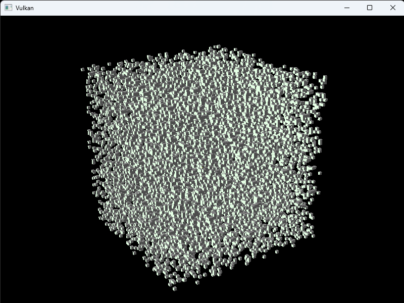

| Some bug/WIP screenshots that are neat | .                         |
| -------------------------------------- | ------------------------- |
| 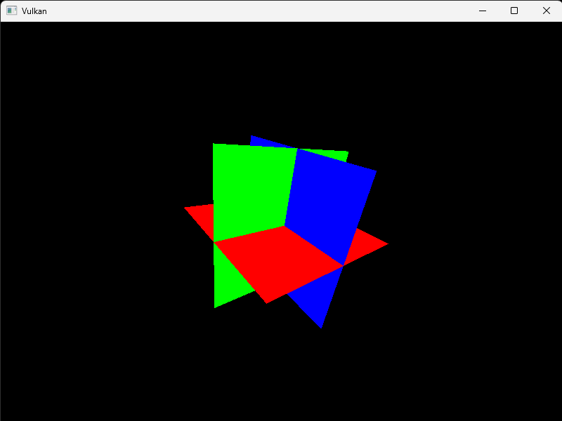              | 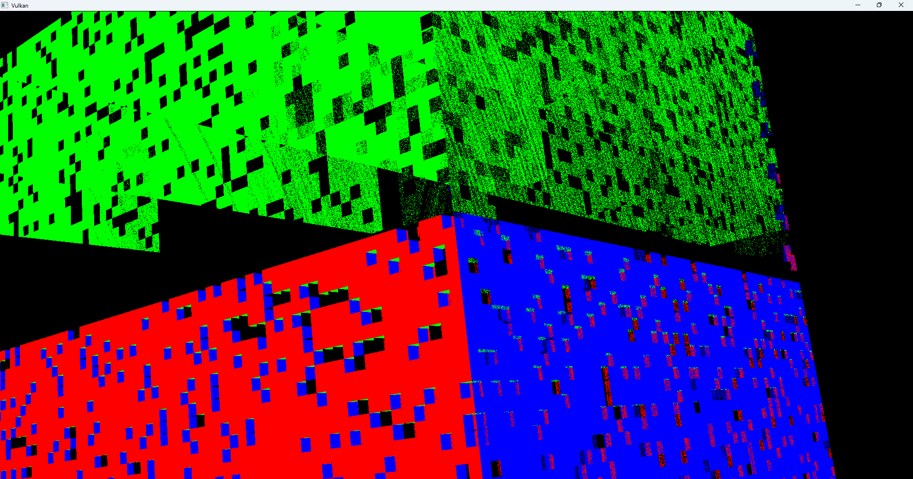 |
| 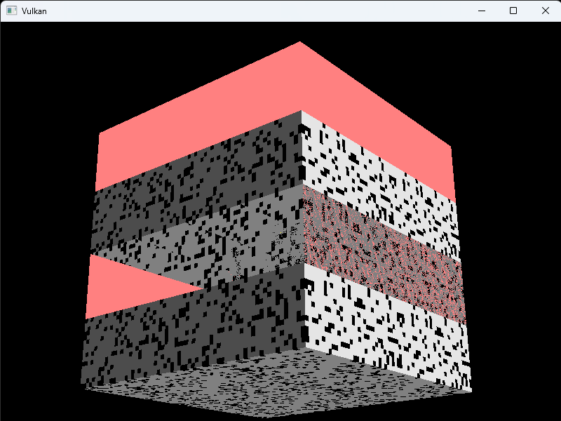              | 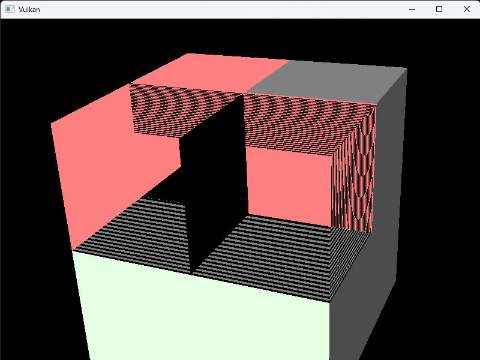 |
| 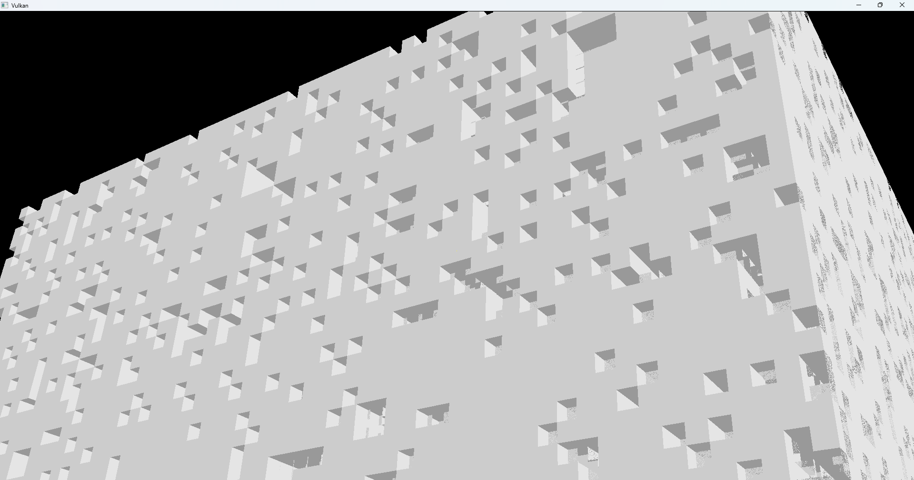              | 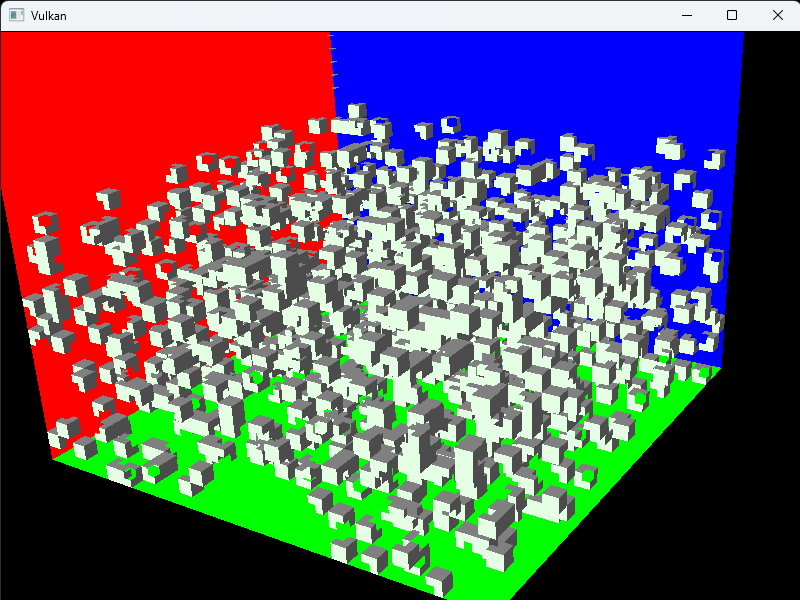 |

## 2024-04-04

Restructured pipelines so that the compute shader writes to an image, and then that image is passed into the fragment shader as a texture/sampler. All of the Vulkan code has become complete spaghetti, so will need to spend a lot of time refactoring it. Will probably start doing some voxel stuff first and do refactoring in between - I shouldn't need to make too many changes to the rendering/compute pipelines besides adjusting storage/uniform buffers for the next while.

| Drawing the texture onto a rotating quad  | Drawing texture across whole screen       |
| ----------------------------------------- | ----------------------------------------- |
| 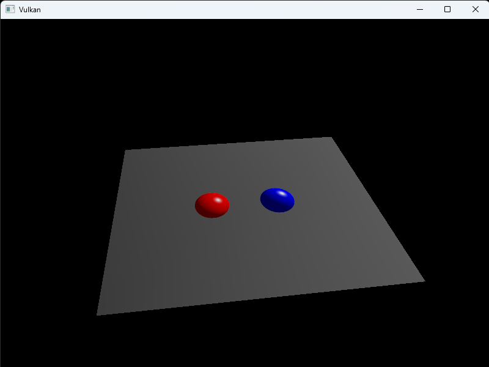 | 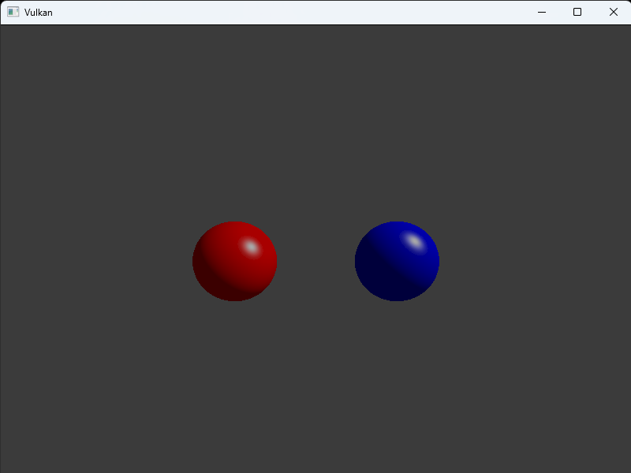 |

## 2024-04-02

Busy with other things so didn't touch this for a little while, but bodged together the compute pipeline. Made the particles example from vulkan-tutorial.com, and even got a sketchy little raytracer working on the particles code since I was too impatient to set up all of the resources for writing to a texture image and so on.

| vulkan-tutorial.com compute shader particles example | sketchy raytracer made by modifying shader code from particles example |
| ---------------------------------------------------- | ---------------------------------------------------------------------- |
| 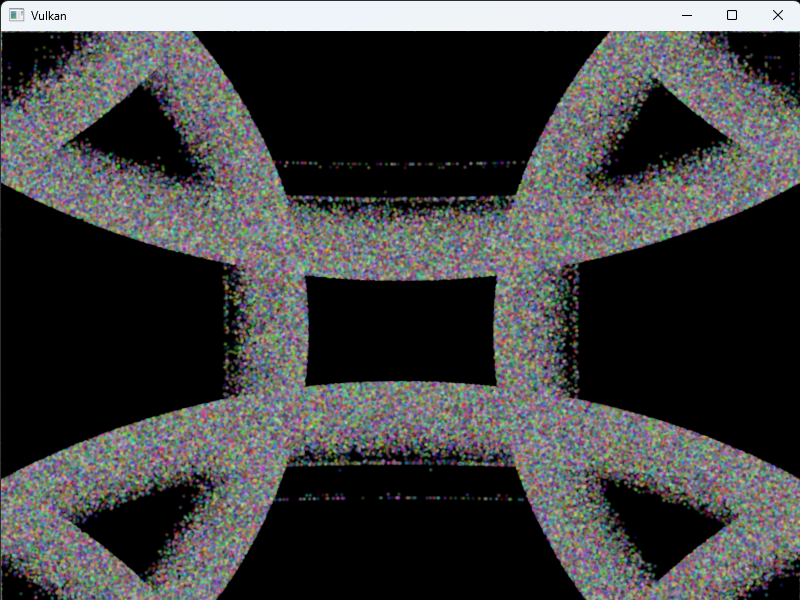            | 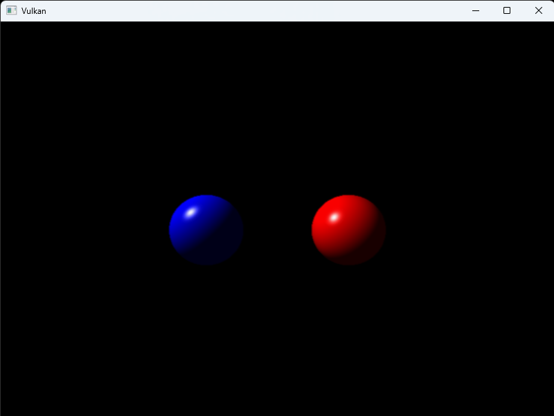                              |

## 2024-03-20

Added ImGui with some basic functionality for changing certain rendering settings. Fixed issues from previous update, which were primarily due to declaring Vulkan Structs within conditional scopes, and the compiler tossing the pointers (whoops).

Next step is to implement a compute shader which is what I'll be using for the voxel rendering. Since I want to do raycasting, I would like to try the hardware raytracing at some point, but I also want to implement a procedurally generated sparse voxel octree, and I'm not sure how to implement a vulkan acceleration structure with such a thing (or at all to be fair).

| textures disabled (using a rough diffuse lighting) | displaying normals with the z buffer disabled |
| -------------------------------------------------- | --------------------------------------------- |
| 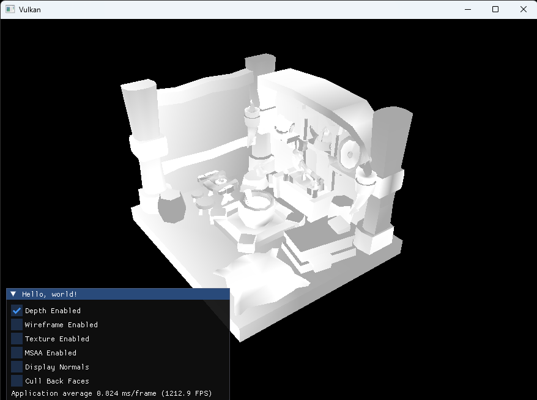              | 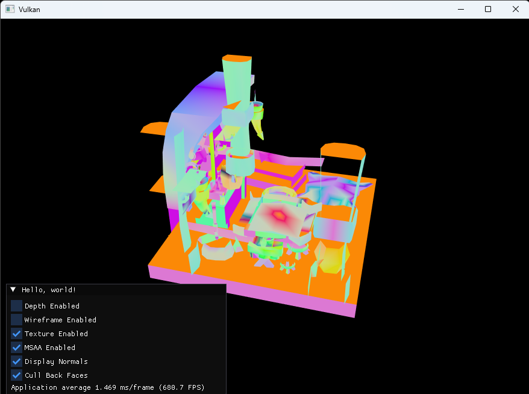         |

## 2024-03-16

Finished abstracting a basic rasterization application
into classes a couple days ago, have since been trying
to inject some flexibility into the configuration,
rather than everything being hard-coded. Tackling a
couple bugs at the moment that seem to be due to some
sort of misalignment between attachments at different stages.
(bug would only occur in release mode at first, but my attempts
at fixing it have caused it to spread to debug as well
in certain configurations).

Hoping to add ImGUI next to test adjusting various
configuration settings live.

## 2024-03-11

Plan with this project is to make a voxel engine
(and just to learn Vulkan).

Completed most of https://vulkan-tutorial.com/ a
couple nights ago, and now trying to abstract
all of the Vulkan objects and initialization
code into classes. I could of course have just
used Vulkan-Hpp (https://github.com/KhronosGroup/Vulkan-Hpp)
or another set of C++ bindings, but I wanted
to do it myself to gain a better understanding
of what all the VK objects do and how they
interact. So far the class implementation are
very rigid, not allowing for much customization
of the pipelines, but plan is to just add
functionality for flexibility as the project
progresses.
