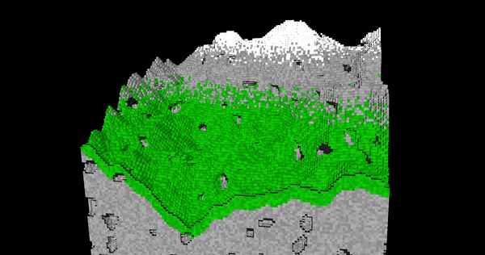

# C++ Vulkan Voxel Octree Ray Marcher

This is an ongoing project where I'm trying to make a performant voxel rendering engine using C++ and Vulkan.

Current pipeline is as follows:

- Main Resources:
  - SSBOs:
    - Bitmask Voxel Octree Array:
      - Buffer containing all voxel data in bitmask octrees
    - Octree Chunk Hash Table:
      - Hash table which maps chunk coordinates to indices in the Bitmask Voxel Octree Array
  - Images:
    - Depth Image:
      - R32 format image used in initial depth pass
    - Canvas Image:
      - RGB image written to by compute shaders and sampled by fragment shader
- Shader Stages:
  - Initial Depth Pass Compute Shader:
    - Compute shader which runs at half screen resolution.
    - Marches rays through octree chunks
    - Writes depth values to depth image, and colour values to canvas image
  - Full Ray March Compute Shader:
    - Runs at full screen resolution minus resolution of initial depth pass
    - Marches rays through octree chunks, but using starting point based on depth values sampled from depth image
    - Writes colour values to canvas image
  - Vertex Shader & Fragment Shader:
    - A quad is drawn which spans the screen, and the canvas image is sampled as a texture.

If you want to run this project on your machine, the repo contains all of the vendor libraries/code needed and the VS 2022 solution should configure everything properly (haven't tested), but if you're using anything else, sorry. I do intend on switching the build system to CMake at some point.

Having started this project with no knowledge of Vulkan, I've wasted many hours implementing features that OpenGL would have given me out of the box and as my reward, I will likely end up with slightly worse performance than if I were to just let OpenGL do all of that work for me. I chose Vulkan because I just looove learning new things 🙃.

The rest of this readme is a devlog detailing all of this learning.

## 2024-05-22

Busy few weeks, less to update on. The low res depth pass optimization is now pretty stable and provides a solid increase in framerate (often 50% higher fps) with neglibible loss in image quality.

Have mostly been trying different ways to dynamically load/unload chunks. I've been incorporating multithreading into chunk generation which is pretty straightforward, and then working on updating the SSBOs in worker threads as well.

Chunks can now be generated on CPU quite quickly without interupting the render, but getting the chunk buffers onto the GPU has been tricky. Just need to figure out how to update buffers in background threads without running into any sort of access issues or halting shaders.

In the gif below, chunks are generated in worker threads (5 128x128x128 chunks per update), but when the generation is finished, the upload to GPU is still interrupting the render. You can see the frametime spikes in the plot on the GUI.

## 2024-05-01

### Bitmask Octree:

A couple of big changes since last update - after rewriting my Vulkan abstractions, I opted to switch from a sparse voxel octree to a bitmask octree. Previously, each octree "node" contained a list of pointers to child nodes, which would be set to -1 for empty nodes, and other negative numbers would refer to materials.

With the new bitmask octree, every node in the tree is given an index in the final octree array (including empty nodes), but nodes are now single unsigned integers, containing an 8-bit bitmask of valid child nodes, and additional bits for information pertaining to the material (with some bits to spare, so I'll see what I can use them for later).

While the new solution holds more nodes, each node takes up an eight of the memory of the previous solution, so the final array ends up only being slightly larger. The main reason for switching however, is that when I eventually implement realtime modifications to the voxel world, the bitmask solution will allow for fast updates without having to rebuild the entire chunk.

Since all of the nodes are in the bitmask octree array, and are sorted by depth, I can then find the index of the children nodes quite simply based on the current nodes index and it's depth within the octree:

1. For depth `n` of the octree, there will be `8^n` nodes. The starting index of depth `n` within the octree array will be equal to `8^(n-1) + 8^(n-2) + ... + 8(0)`.

2. If the current node is at index `i` and depth `d`, and we wish to find it's `n`th child, we:

   1. subtract the starting index of depth `d`
   2. multiptly index `i` by 8 (or bitshift by 3)
   3. add `n` for the child index
   4. add the starting index of depth `d+1`

3. By maintaining an array of each depth's starting index, and a variable holding the bitshifted indices of each node leading to the current child node, this operation becomes just a bitshift and two additions.

### Using a low res intial depth pass for optimization:

The second big change I am working on is using a low resolution depth pass for optimizing the raymarching. The idea is that by running a depth pass at half resolution before fully rendering the scene, the full pass can start its rays much closer to the collision points, requiring fewer traversal of octree nodes.

So far I have a basic implementation of this working with a second compute pipeline now running before my main raymarcher. So far it has shown very slight performance improvements, but it was bodged together in an afternoon and has plenty of room for improvement. It also has some issues related to synchronisation resulting in image tearing, so I will have to figure out how to get vulkan barriers working.

I found this idea on Douglas Dwyer's youtube channel, he explains it well in this video: https://www.youtube.com/watch?v=P2bGF6GPmfc,.

## 2024-04-22

Finally reaching the end of restructuring all of the Vulkan code, still plenty of cleaning up to do though. I've also brought back the gui and started adding some features for debugging and adjustments. I implemented controls for the resolution as well, which adjusts the size of the texture that the compute shader writes to.

## 2024-04-12

With the now functional raycaster, I implemented some terrain generation with perlin noise, and added colours to the voxels. Also made a shader for visualizing the octree structure, and one with simple ray-traced shadows.

Going to be doing a full rewrite of my Vulkan code next, since the class structure I implemented at first doesn't lend well to the pipeline I'm currently using (everything's very spaghetti right now). Once that's done, I will probably get to work on a new GUI system or try chunk-loading.

| Perlin Noise Terrain                       | Octree Visualization                          |
| ------------------------------------------ | --------------------------------------------- |
|  |  |

#### Ray-tracing shadows:

## 2024-04-10

After wayyy too much wrestling with compute shaders, finally got a working implementation of a raycaster that traverses a sparse voxel octree. The CPU-side octree building was pretty straight-forward. The algorithm I have now is pretty naive and slow, so I'll need to make changes to handle fast updates to the tree down the line when implementing voxel breaking/building. I ran into a ridiculous number of bugs while implementing the octree traversal in my compute shader, but I have a working implementation now, and can work on optimizing and adding new features (lighting, shadows, materials, etc.).

### Successfully rendering a randomized 64 x 64 SVO

| Some bug/WIP screenshots that are neat | .                         |
| -------------------------------------- | ------------------------- |
|               |  |
|               |  |
|               |  |

## 2024-04-04

Restructured pipelines so that the compute shader writes to an image, and then that image is passed into the fragment shader as a texture/sampler. All of the Vulkan code has become complete spaghetti, so will need to spend a lot of time refactoring it. Will probably start doing some voxel stuff first and do refactoring in between - I shouldn't need to make too many changes to the rendering/compute pipelines besides adjusting storage/uniform buffers for the next while.

| Drawing the texture onto a rotating quad  | Drawing texture across whole screen       |
| ----------------------------------------- | ----------------------------------------- |
|  |  |

## 2024-04-02

Busy with other things so didn't touch this for a little while, but bodged together the compute pipeline. Made the particles example from vulkan-tutorial.com, and even got a sketchy little raytracer working on the particles code since I was too impatient to set up all of the resources for writing to a texture image and so on.

| vulkan-tutorial.com compute shader particles example | sketchy raytracer made by modifying shader code from particles example |
| ---------------------------------------------------- | ---------------------------------------------------------------------- |
|             |                               |

## 2024-03-20

Added ImGui with some basic functionality for changing certain rendering settings. Fixed issues from previous update, which were primarily due to declaring Vulkan Structs within conditional scopes, and the compiler tossing the pointers (whoops).

Next step is to implement a compute shader which is what I'll be using for the voxel rendering. Since I want to do raycasting, I would like to try the hardware raytracing at some point, but I also want to implement a procedurally generated sparse voxel octree, and I'm not sure how to implement a vulkan acceleration structure with such a thing (or at all to be fair).

| textures disabled (using a rough diffuse lighting) | displaying normals with the z buffer disabled |
| -------------------------------------------------- | --------------------------------------------- |
|               |          |

## 2024-03-16

Finished abstracting a basic rasterization application
into classes a couple days ago, have since been trying
to inject some flexibility into the configuration,
rather than everything being hard-coded. Tackling a
couple bugs at the moment that seem to be due to some
sort of misalignment between attachments at different stages.
(bug would only occur in release mode at first, but my attempts
at fixing it have caused it to spread to debug as well
in certain configurations).

Hoping to add ImGUI next to test adjusting various
configuration settings live.

## 2024-03-11

Plan with this project is to make a voxel engine
(and just to learn Vulkan).

Completed most of https://vulkan-tutorial.com/ a
couple nights ago, and now trying to abstract
all of the Vulkan objects and initialization
code into classes. I could of course have just
used Vulkan-Hpp (https://github.com/KhronosGroup/Vulkan-Hpp)
or another set of C++ bindings, but I wanted
to do it myself to gain a better understanding
of what all the VK objects do and how they
interact. So far the class implementation are
very rigid, not allowing for much customization
of the pipelines, but plan is to just add
functionality for flexibility as the project
progresses.
